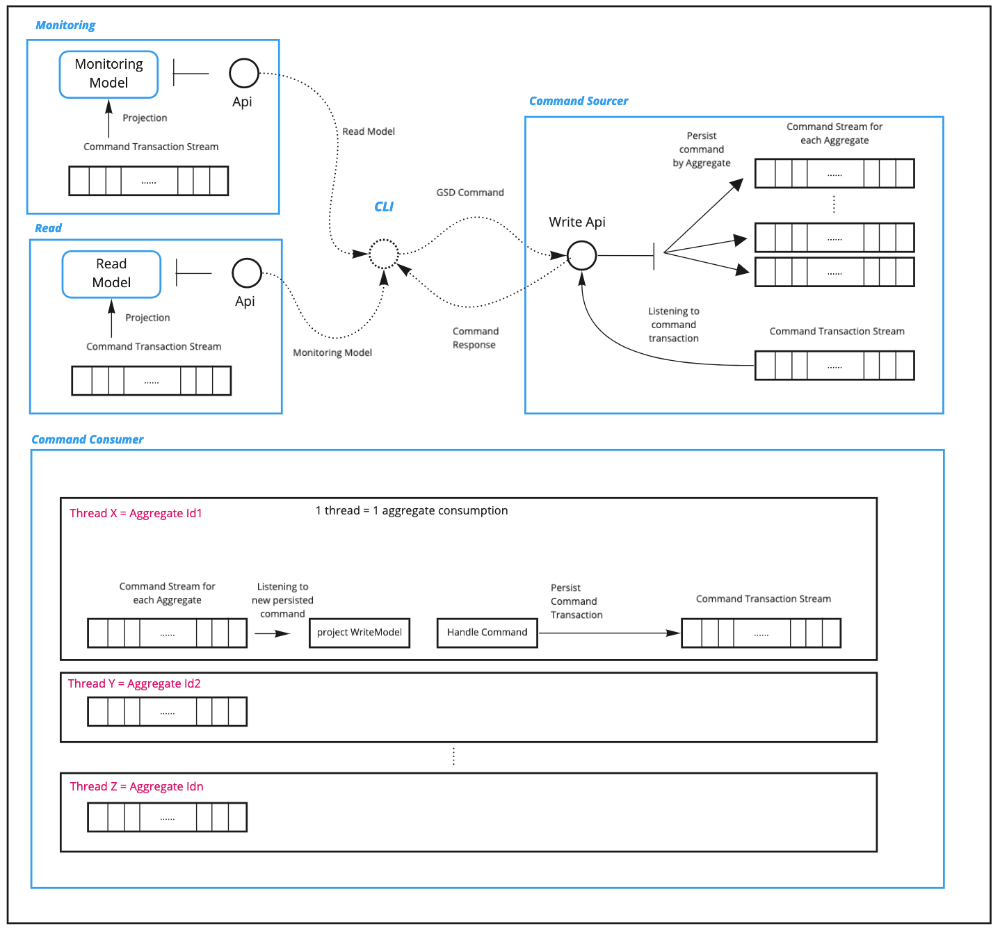

<p align="center">
  TECHNICAL FEATURE SET <br>
  <a href="#">Domain Driven Design</a> |
  <a href="#">Command Sourcing</a> |
  <a href="#">CQRS</a> |
  <a href="#">Functional Reactive Programing</a> |
  <a href="#">Haskell</a>
  <br>
</p>
<h1> </h1>

- <a href="#1-definitions">1. Definitions</a>
- <a href="#2-microservices">2. Microservices</a>
   - <a href="#21-overview">2.1 Overview</a>
   - <a href="#22-resiliency-and-high-availability">2.2 Resiliency and high availability</a>
   - <a href="#23-health-check-mechanism-demo">2.3 Health-Check Mechanism Demo</a>
- <a href="#3-bounded-contexts">3. Bounded Contexts</a>
- <a href="#4-streams-and-logs">4. Streams and Logs</a>
- <a href="#5-emergent-cqrs-framework">5. Emergent CQRS framework</a>

<h1> </h1>

## 1. Definitions

GSD is a distributed application based on the following concepts :
- [Domain Driven Design](https://en.wikipedia.org/wiki/Domain-driven_design) (DDD)
    - Place the project's primary focus on the core domain and domain logic
    - Base complex designs on a model of the domain
- [CQRS](https://docs.microsoft.com/en-us/azure/architecture/patterns/cqrs)
    - It stands for Command Query Responsibility Segregation.
    - It also known as the distributed version of DDD (and then DDDD as Distributed Domain Driven Design)
- Command Sourcing ( [Event Sourcing](https://martinfowler.com/eaaDev/EventSourcing.html) ++)
    - It's Event Sourcing where commands are also persisted
        - Capture all changes to an application state as a sequence of events
        - Capture all the commands sent to the system
    - Commands sent to the system are stored and consumed asynchronously as opposed to Event Sourcing
        - Command losses are reduced when the service is down
        - The data flow is pulled as opposed to pushed in Event Sourcing
        - Processes are embedded in a stream from A-Z
    - This command consumption produces and stores a single transaction :
```haskell
data CommandHandlingResult =   CommandRejected   { reason ::  RejectionReason}
                             | CommandValidated  { events ::  [Event]}

data CommandTransaction = CommandTransaction {
                              commandId :: CommandId,
                              commandOffset :: Offset ,
                              aggregateId :: AggregateId ,
                              commandHandlingResult :: CommandHandlingResult }
```
- [Functional Reactive Programing](https://en.wikipedia.org/wiki/Functional_reactive_programming)
    - it's a programming paradigm for reactive programming (asynchronous dataflow programming) using the building blocks of functional programming (e.g. map, reduce, filter).
    - Streams and Logs (FIFO) are natural DDDD Architecture Building Blocks.
- [Micro-service Architecture](https://en.wikipedia.org/wiki/Microservices)
    - Services are small in size
    - Messaging enabled
    - Bounded by contexts
    - Autonomously developed
    - Independently deployable
    - Decentralized
    - Built and released with automated processes.

All these concepts are building blocks for implementing the [Kahn process networks (KPNs, or process networks)](https://en.wikipedia.org/wiki/Kahn_process_networks). They are a concurrent [model of computation](https://en.wikipedia.org/wiki/Model_of_computation) which can be also considered as a Pattern / Architecture for distributed systems.

Related Articles :

- https://martinfowler.com/eaaDev/EventSourcing.html
- http://www.cqrs.nu/faq
- https://thinkbeforecoding.com/post/2013/07/28/Event-Sourcing-vs-Command-Sourcing
- https://blog.jonathanoliver.com/cqrs-sagas-with-event-sourcing-part-i-of-ii/


## 2. Microservices

### 2.1 Overview

The GSD application is made of 6 distributed services :

- `cli` - Command Line Interface to pilot the system.
    - Send commands to the system
    - Read eventually up-to-date projections from the Read service
    - Read eventually up-to-date projections from a Monitoring service

- `command-sourcer`
    - Receive commands
    - Dispatch and Persist these commands

- `command-consumer` - Command Consumption Orchestration (CQRS Sagas Terminology)
    - Listen on commands arriving on the command stream for each aggregates
    - Re-build the write model from the previous command transactions
    - Perform the transactions on each command persisted (`handleCommand`), a command can be :
        - Accepted (contains events)
        - Rejected (contains the reason of rejection)
    - Persist these command transactions

- `gsd-read`
    - Read from the command transaction streams
    - Project a model optimised for the read
    - Serve that model to the cli service

- `gsd-monitoring`
    - Read the command transaction and the command streams
    - Project a model optimised for monitoring the system
    - Serve that model to the cli service

- `eventstore-service` - embedded into a docker container
    - Implement the [`PersistedStreamEngine` interface](../src/Eventuria/Libraries/PersistedStreamEngine) .
    - Persist and give access to Logs

<p align="center">
  
</p>

### 2.2 Resiliency and high availability

Each service is safe and can only be terminated by
- a SIG-INT (releasing resources properly)
- a SIG-KILL

Each service has a built-in bootstrap health-check mechanism and come back in that mechanism whenever it becomes unhealthy.

- Regarding the GSD application
    - `cli` is healthy, when the following dependencies are healthy :
        - `command-sourcer`
        - `command-consumer`
        - `gsd-read`
        - `gsd-monitoring`

    - `command-sourcer` is healthy, when `eventstore-service` is healthy
    - `command-consumer` is healthy, when `eventstore-service` is healthy
    - `gsd-read` is healthy, when `eventstore-service` is healthy
    - `gsd-monitoring` is healthy, when `eventstore-service` is healthy

### 2.3 Health-Check Mechanism Demo

<p align="center">
  
</p>


##  3. Bounded Contexts

`Eventuria` is the name of the company hosting the project (root package). By flicking through the codebase under `Eventuria`, you'll see the following packages :

 <div><br>
- [`Adapters`](../src/Eventuria/Adapters) : Contains wrappers, tweaks on external libraries
    - [`Byline`](../src/Eventuria/Adapters/ByLine) : Command Line Interface [Library](http://hackage.haskell.org/package/byline) used for the `cli` service
    - [`Servant`](../src/Eventuria/Adapters/Servant) : HTTP Client and Server [Library](https://github.com/haskell-servant) used for micro-services communication
    - [`Streamly`](../src/Eventuria/Adapters/Streamly) : Streaming [Library](https://github.com/composewell/streamly)

- [`Commons`](../src/Eventuria/Commons) : Tiny Bounded Contexts

- [`GSD`](../src/Eventuria/GSD) : GSD Application Bounded Context, you'll find the 4 services cited previously in that doc
    - [`CLI`](../src/Eventuria/GSD/CLI) : `gsd-cli` implementation
    - [`Write`](../src/Eventuria/GSD/Write) :
        - `gsd-command-consumer`
        - `gsd-command-sourcer`
    - [`Read`](../src/Eventuria/GSD/Read) : `gsd-read` implementation
    - [`Monitoring`](../src/Eventuria/GSD/Monitoring) : `gsd-monitoring` implementation

- [`Libraries`](../src/Eventuria/Libraries)
    - [`CQRS`](../src/Eventuria/Libraries/CQRS) : CQRS Bounded Context (this Library will eventually become a Framework - see [Emergent CQRS framework](#5-emergent-cqrs-framework) Section )
    - [`PersistedStreamEngine`](../src/Eventuria/Libraries/PersistedStreamEngine)
        - Interface for Reading/Subscribing/Writing messages to Logs (persisted streams)
        - Contain one instance for the [EventStore](https://eventstore.org/)

All these packages will eventually be in their own git repository as they get more mature.
</div>
<br><br><br>

##  4. Streams and Logs

- `command-sourcer`
    - Handle an Aggregate index  (AggregateId Stream)
    - Serve Command Requests - Feed the Command Streams (1 Command Stream per Aggregate)
- `command-consumer` - Per aggregate :
    - Subscribe to Commands
    - Project a write Model
    - Handle each command by providing a Command Transaction :
        - Accepted (contains events)
        - Rejected (contains the reason of rejection)
    - Feed the Command Transaction Stream
- `gsd-read`
    - Read a Command Transaction Stream
    - Project from command transaction to a specific read model
    - Serve clients with this model
- `gsd-monitoring`
    - Read a Command Transaction Stream
    - Project from command transaction to a specific read model
    - Serve clients with this model

<p align="center">
  
</p>


##  5. Emergent CQRS framework

One of the intents when starting this project was to formalize the CQRS pattern and get eventually a Framework out of a concrete application like GSD. This is what the package [`Eventuria.CQRS`](../src/Eventuria/Libraries/CQRS)  will eventually become...
To use this framework, the GSD application provides the following :

- a specific WriteModel ([GSD `WriteModel`](../src/Eventuria/GSD/Write/Model/WriteModel.hs))
- a map between the application and CQRS events ([GSD `Commands`](../src/Eventuria/GSD/Write/Model/Events/Event.hs))
- a map between the application and CQRS commands ([GSD `Events`](../src/Eventuria/GSD/Write/Model/Commands/Command.hs))
- a Command Consumption Orchestration ([GSD `Orchestration`](../src/Eventuria/Libraries/CQRS/Write/CommandConsumption/Orchestration.hs))
- 2 functions (`ProjectWriteModel` and `HandleCommand`)
    ```haskell
    data CommandHandlingResult =   CommandRejected   { reason ::  RejectionReason}
                                 | CommandValidated  { events ::  [Event]}

    type ProjectWriteModel writeModel = Maybe writeModel ->
                                        CommandHandlingResult ->
                                        Maybe writeModel

    type HandleCommand writeModel = Maybe writeModel ->
                                    (Persisted Command) ->
                                    IO (CommandHandlingResult)
    ```
- [GSD `ProjectWriteModel`](../src/Eventuria/GSD/Write/CommandConsumer/Handling/ProjectGSDWriteModel.hs)
- [GSD `HandleCommand`](../src/Eventuria/GSD/Write/CommandConsumer/Handling/HandleGSDCommand.hs)


<h1> </h1>


