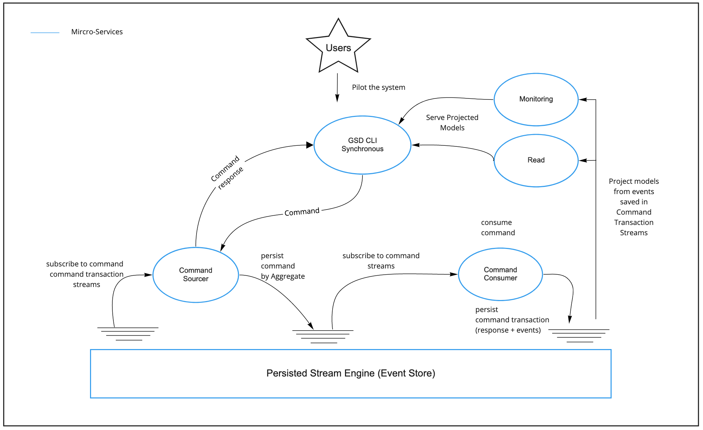

# Technical features
1. <a href="#1-definitions">Definitions</a>
2. <a href="#2-microservices">Microservices</a>
   1. <a href="#21-overview">Overview</a>
   2. <a href="#22-resiliency-and-high-availability--health-check-mechanism">Resiliency and high availability</a>
   3. <a href="#23-demo">Health-check Mechanism Demo</a>
3. <a href="#">DataFlow</a>
4. <a href="#">Packaging</a>
<h1> </h1>

## 1. Definitions

GSD is distributed application based on the following concepts :
- [Domain Driven Design](https://en.wikipedia.org/wiki/Domain-driven_design) (DDD)
    - Place the project's primary focus on the core domain and domain logic
    - Base complex designs on a model of the domain
- [CQRS](https://docs.microsoft.com/en-us/azure/architecture/patterns/cqrs)
    - It stands for Command Query Responsibility Segregation.
    - It also known as the distributed version of DDD (and then DDDD as Distributed Domain Driven Design)
- Command Sourcing ( [Event Sourcing](https://martinfowler.com/eaaDev/EventSourcing.html) ++)
    - It's Event Sourcing where commands are also persisted
        - Capture all changes to an application state as a sequence of events
        - Capture all the commands sent to the system
    - Commands sent to the system are stored and consumed asynchronously as opposed to Event Sourcing
        - The command loss when the service is down is reduced.
        - The data flow is pulled as opposed to pushed in Event Sourcing
        - you work in a stream from A-Z
    - This command consumption produces and stores in a single transaction containing
        - The Events
        - The Command Response
- [Functional Reactive Programing](https://en.wikipedia.org/wiki/Functional_reactive_programming)
    - it's a programming paradigm for reactive programming (asynchronous dataflow programming) using the building blocks of functional programming (e.g. map, reduce, filter).
    - Streams (dataflow) are ubiquitous in GSD and Logs (FIFO) are the persisted version of them.
- [Micro-service Architecture](https://en.wikipedia.org/wiki/Microservices)
    - Services are small in size
    - Messaging (Commands) enabled
    - Bounded by contexts
    - Autonomously developed
    - Independently deployable
    - Decentralized
    - Built and released with automated processes.

All these concepts are building blocks for implementing [Kahn process networks (KPNs, or process networks)](https://en.wikipedia.org/wiki/Kahn_process_networks)

it's a concurrent [model of computation](https://en.wikipedia.org/wiki/Model_of_computation) which can be also considered as a Pattern / Architecture for distributed systems

related articles :

- https://martinfowler.com/eaaDev/EventSourcing.html
- http://www.cqrs.nu/faq
- https://thinkbeforecoding.com/post/2013/07/28/Event-Sourcing-vs-Command-Sourcing
- https://blog.jonathanoliver.com/cqrs-sagas-with-event-sourcing-part-i-of-ii/

## 2. Microservices

### 2.1 Overview

GSD is made of 6 distributed services :

- `cli` : it's a command line interface to pilot the system.
    - Sent commands to the system
    - Move to the next interface when the command is processed
    - Read eventually updated projections from its read service (hosting the gsd read model)
    - Read eventually updated projections from a monitoring service

- `command-sourcer`
    - Receives commands
    - Dispatch and Persist these commands in an aggregate command stream

- `command-consumer`
    - subscribe to new commands on each aggregate
    - Consume the command
        - updates the write model : : `WriteModel -> Events -> WriteModel`
        - handles the command : `Command -> WriteModel -> CommandTransaction`
        - persists these CommandTransaction stream (1 per aggregate), a command transaction can be :
            - Accepted (contains events)
            - Rejected (contains the reason of rejection)

- `gsd-read`
    - reads events from the command transaction streams
    - projects a model from these events optimised for the read
    - serves that read model to the cli service

- `gsd-monitoring`
    - reads the command transaction and the command streams
    - projects a model from these events optimised for the monitoring the system
    - serves that monitoring model to the cli service

- `eventstore-service`
    - persist and give access to streams for the system
    - it's embedded into a docker container
    - it could be replaced by any other engine that implement the interfaces provided in the project.

  

### 2.2 Resiliency and high availability

Each service are safe (streams and bootstrap) and can only terminate by
- a SIG-INT (releasing resources properly)
- a SIG-KILL

Each service has a built-in bootstrap health-check mechanism.
The services can run till they call an unhealthy dependency, at this moment they come back in that health-check mechanism.

- `cli` is healthy, when the following dependencies are healthy :
    - `command-sourcer`
    - `command-consumer`
    - `gsd-read`
    - `gsd-monitoring`

- `command-sourcer` is healthy, when `eventstore-service` is healthy
- `command-consumer` is healthy, when `eventstore-service` is healthy
- `gsd-read` is healthy, when `eventstore-service` is healthy
- `gsd-monitoring` is healthy, when `eventstore-service` is healthy

### 2.3 Health-check Mechanism Demo

  

##  3. Bounded Contexts

`Eventuria` is the name of the company hosting te codebase and it's the root package of the codebase.
By flicking through the codebase under `Eventuria`, you'll see the following packages :

 

- `Adapters` : it contains wrapper, tweaks on external libraries used within the company
    - `Byline` : the command line interface library used for the `cli` service
    - `Servant` : HTTP Client and Server library used for micro-services communication
    - `Streamly` : a Streaming Library
- `Commons` : are tiny bounded contexts used within the company.
- `GSD` : Bounded Context specific to the gsd application, you'll find the 4 services cited previously
    - `CLI` : the `gsd-cli` implementation
    - `Write` :
        - `gsd-command-consumer`
        - `gsd-command-sourcer`
    - `Read` : the `gsd-read` implementation
    - `Monitoring` : the `gsd-monitoring` implementation
- `Libraries`
    - `CQRS` : Bounded Context Specific to the pattern, it could be eventually reused by other application implementing the same architecture
    - `PersistedStreamEngine`
        - It's an interface for reading/subscribing/writing messages streams (commands and command transactions streams in our case)
        - It contains one instance for the [EventStore](https://eventstore.org/)

All these packages will eventually be in their own github repository as they get more mature.

<h1> </h1>

